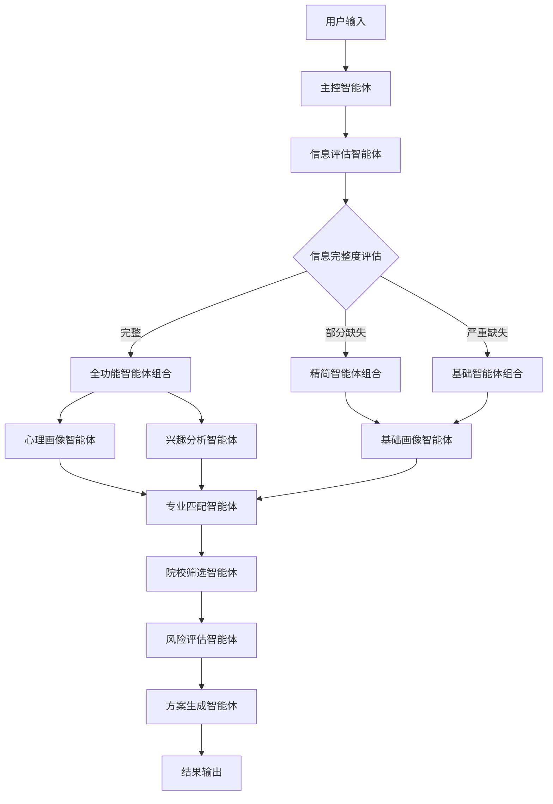

优秀的问题！让我为你详细设计一个动态智能体系统，能够根据用户信息完整度智能选择和协调不同的智能体。

## 智能体系统详细规划

### 1. 智能体总体架构（12个核心智能体）

**第一层：协调管理智能体**
- **主控智能体 (Master Coordinator Agent)**
- **信息评估智能体 (Information Assessment Agent)**

**第二层：数据获取智能体**
- **数据爬虫智能体 (Data Crawler Agent)**
- **政策监控智能体 (Policy Monitor Agent)**

**第三层：用户分析智能体**
- **基础画像智能体 (Basic Profile Agent)**
- **心理画像智能体 (Psychological Profile Agent)**
- **兴趣分析智能体 (Interest Analysis Agent)**

**第四层：匹配分析智能体**
- **专业匹配智能体 (Major Matching Agent)**
- **院校筛选智能体 (College Filtering Agent)**
- **地域分析智能体 (Location Analysis Agent)**

**第五层：决策支持智能体**
- **风险评估智能体 (Risk Assessment Agent)**
- **方案生成智能体 (Solution Generation Agent)**

### 2. 各智能体详细功能设计

#### **主控智能体 (Master Coordinator Agent)**
**核心职责：**
- 接收用户请求，分析信息完整度
- 动态决定调用哪些智能体
- 协调各智能体的执行顺序和优先级
- 整合所有智能体的输出结果

**决策逻辑：**
```python
# 伪代码示例
def decide_agents(user_data):
    required_agents = ["basic_profile", "data_crawler", "major_matching"]
    optional_agents = []
    
    if user_data.has_mbti or user_data.has_psychology_test:
        optional_agents.append("psychological_profile")
    
    if user_data.has_interest_survey:
        optional_agents.append("interest_analysis")
    else:
        # 使用基础推理替代
        optional_agents.append("basic_interest_inference")
    
    if user_data.has_location_preference:
        optional_agents.append("location_analysis")
    
    return required_agents + optional_agents
```

#### **信息评估智能体 (Information Assessment Agent)**
**核心职责：**
- 评估用户输入信息的完整度和质量
- 识别缺失的关键信息维度
- 为其他智能体提供信息可信度评分
- 生成信息补充建议

**评估维度：**
```yaml
信息完整度评估:
  必需信息(权重100%):
    - 省份: 必需
    - 高考分数: 必需
    - 选科组合: 必需
  
  重要信息(权重80%):
    - 性别: 影响专业和院校推荐
    - 地域偏好: 影响院校筛选
    - 职业期望: 影响专业匹配
  
  辅助信息(权重50%):
    - MBTI类型: 增强个性化推荐
    - 心理测评: 提升匹配准确度
    - 兴趣偏好: 优化专业选择
    - 家庭经济状况: 影响院校选择
```

#### **基础画像智能体 (Basic Profile Agent)**
**核心职责：**
- 处理用户的基础必填信息
- 基于分数和选科进行初步专业方向推断
- 在缺少心理测评时提供基础性格推测
- 生成用户基础标签

**推理策略：**
- 基于选科组合推断学科偏好
- 基于分数区间推断学习能力层次
- 基于地域推断可能的文化背景偏好

#### **心理画像智能体 (Psychological Profile Agent)**
**激活条件：** 用户填写了MBTI或心理测评
**核心职责：**
- 解析MBTI类型对应的专业适配性
- 分析心理测评结果的职业倾向
- 生成详细的性格-专业匹配报告
- 预测用户在不同环境下的适应性

**降级策略（无心理数据时）：**
- 基于选科组合进行性格推断
- 使用统计模型进行大致分类
- 降低心理匹配权重，提高其他维度权重

#### **兴趣分析智能体 (Interest Analysis Agent)**
**激活条件：** 用户完成了兴趣调研
**核心职责：**
- 基于霍兰德职业兴趣理论分析用户类型
- 匹配兴趣类型与专业的对应关系
- 生成兴趣-专业匹配度评分

**兜底机制（无兴趣数据时）：**
- 基于选科组合推断潜在兴趣
- 使用同类用户的兴趣模式
- 提供多样化的专业选择降低风险

#### **专业匹配智能体 (Major Matching Agent)**
**核心职责：**
- 综合所有用户画像数据进行专业匹配
- 计算专业与用户的综合适配度
- 考虑专业的就业前景和发展趋势
- 生成专业推荐列表和匹配理由

**匹配算法：**
```python
# 专业匹配评分公式
def calculate_major_score(user_profile, major_info):
    score = 0
    
    # 基础匹配（必须有的数据）
    score += ability_match(user_profile.academic_ability, major_info.difficulty) * 0.3
    score += subject_match(user_profile.subjects, major_info.requirements) * 0.3
    
    # 心理匹配（可选数据）
    if user_profile.has_psychology_data:
        score += personality_match(user_profile.mbti, major_info.suitable_types) * 0.2
    else:
        # 使用基础推断替代
        score += basic_personality_inference(user_profile.subjects, major_info) * 0.1
    
    # 兴趣匹配（可选数据）
    if user_profile.has_interest_data:
        score += interest_match(user_profile.interests, major_info.interest_types) * 0.2
    else:
        # 降低权重，增加多样性
        score += diversity_bonus() * 0.1
    
    return score
```

#### **院校筛选智能体 (College Filtering Agent)**
**核心职责：**
- 基于分数范围筛选可报考院校
- 考虑院校的专业实力排名
- 分析院校男女比例与用户匹配度
- 评估院校的综合性价比

#### **地域分析智能体 (Location Analysis Agent)**
**激活条件：** 用户有明确地域偏好或需要地域建议
**核心职责：**
- 分析不同城市的发展机会
- 评估生活成本与就业前景的平衡
- 考虑气候、文化等软性因素
- 提供地域选择的利弊分析

#### **风险评估智能体 (Risk Assessment Agent)**
**核心职责：**
- 评估志愿填报的录取风险
- 分析专业选择的就业风险
- 计算不同方案的风险系数
- 提供风险控制建议

#### **方案生成智能体 (Solution Generation Agent)**
**核心职责：**
- 整合所有分析结果
- 生成多套志愿填报方案
- 提供详细的选择理由
- 支持方案个性化调整

### 3. 动态智能体调度机制

#### **智能体调度策略**

```python
class AgentScheduler:
    def __init__(self):
        self.agent_dependencies = {
            "master_coordinator": [],
            "information_assessment": [],
            "basic_profile": ["information_assessment"],
            "psychological_profile": ["information_assessment", "basic_profile"],
            "interest_analysis": ["information_assessment", "basic_profile"],
            "major_matching": ["basic_profile", "psychological_profile?", "interest_analysis?"],
            "college_filtering": ["basic_profile", "major_matching"],
            "location_analysis": ["basic_profile", "college_filtering"],
            "risk_assessment": ["major_matching", "college_filtering"],
            "solution_generation": ["*"]  # 需要所有前置智能体完成
        }
    
    def create_execution_plan(self, user_data):
        """根据用户数据创建智能体执行计划"""
        
        # 第一阶段：信息评估
        plan = ["information_assessment", "basic_profile"]
        
        # 第二阶段：可选分析智能体
        if self.has_psychological_data(user_data):
            plan.append("psychological_profile")
        
        if self.has_interest_data(user_data):
            plan.append("interest_analysis")
        
        # 第三阶段：匹配分析
        plan.extend(["data_crawler", "major_matching", "college_filtering"])
        
        # 第四阶段：地域分析（如果需要）
        if self.needs_location_analysis(user_data):
            plan.append("location_analysis")
        
        # 第五阶段：决策生成
        plan.extend(["risk_assessment", "solution_generation"])
        
        return plan
```

#### **信息缺失时的处理策略**

**策略1：智能体替换**
```python
# 当心理数据缺失时
if not user_data.has_psychology:
    # 不激活心理画像智能体
    # 在专业匹配智能体中使用基础推理模块
    use_basic_personality_inference = True
```

**策略2：权重动态调整**
```python
def adjust_weights_based_on_data_completeness(user_data):
    weights = {
        'academic_ability': 0.4,
        'subject_match': 0.3,
        'personality_match': 0.2,
        'interest_match': 0.1
    }
    
    if not user_data.has_psychology:
        # 重新分配心理匹配的权重
        weights['academic_ability'] += 0.1
        weights['subject_match'] += 0.1
        weights['personality_match'] = 0.0
    
    if not user_data.has_interest:
        # 重新分配兴趣匹配的权重
        weights['academic_ability'] += 0.05
        weights['subject_match'] += 0.05
        weights['interest_match'] = 0.0
    
    return weights
```

**策略3：结果置信度标记**
```python
class RecommendationResult:
    def __init__(self):
        self.recommendations = []
        self.confidence_score = 1.0
        self.missing_data_impact = []
    
    def adjust_confidence_for_missing_data(self, missing_data):
        if 'psychology' in missing_data:
            self.confidence_score *= 0.85
            self.missing_data_impact.append("缺少心理测评数据，个性化匹配准确度可能降低")
        
        if 'interests' in missing_data:
            self.confidence_score *= 0.90
            self.missing_data_impact.append("缺少兴趣偏好数据，专业匹配可能不够精准")
```

### 4. 智能体协作流程



这样的设计既保证了系统的灵活性，也确保了在信息不完整时仍能提供有价值的推荐。你觉得这个智能体架构设计如何？需要我详细展开某个特定智能体的设计吗？
