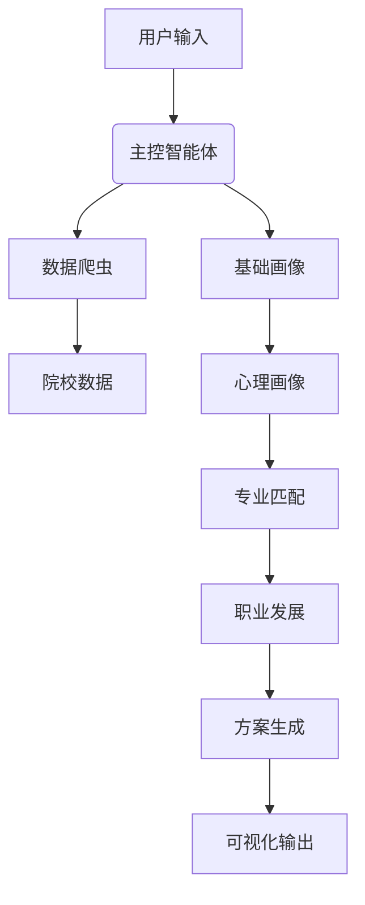
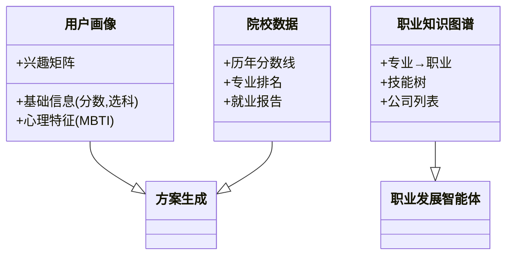

以下是经过系统整理的高考志愿分析填报多智能体系统完整架构设计，涵盖所有智能体的功能、作用及协作机制：

---

### **一、智能体层级架构**
#### **1. 协调管理层（控制中枢）**
| 智能体名称 | 核心功能 | 详细职责 |
|------------|----------|----------|
| **主控智能体** | 系统调度中枢 | 1. 接收用户初始请求<br>2. 动态调用下层智能体<br>3. 处理智能体间冲突<br>4. 最终结果聚合 |
| **信息评估智能体** | 数据质量监控 | 1. 评估用户输入完整性<br>2. 标记缺失关键数据<br>3. 提供数据可信度评分 |

#### **2. 数据获取层（实时更新）**
| 智能体名称 | 核心功能 | 详细职责 |
|------------|----------|----------|
| **数据爬虫智能体** | 多源数据采集 | 1. 院校/专业数据爬取（招生简章、分数线）<br>2. 就业市场数据（BOSS直聘、拉钩等）<br>3. 城市发展数据（GDP、房价） |
| **政策监控智能体** | 政策动态追踪 | 1. 教育部政策解析<br>2. 各省录取规则变化<br>3. 特殊招生政策预警 |

#### **3. 用户分析层（画像构建）**
| 智能体名称 | 核心功能 | 详细职责 |
|------------|----------|----------|
| **基础画像智能体** | 客观数据分析 | 1. 分数-选科匹配度计算<br>2. 学习能力评估（学科优劣势）<br>3. 地域文化偏好推断 |
| **心理画像智能体** | 主观特质分析 | 1. MBTI职业匹配（ENTJ适合管理类）<br>2. 大五人格评估（神经质倾向影响专业选择）<br>3. 抗压能力测试 |
| **兴趣分析智能体** | 兴趣模型构建 | 1. 霍兰德代码计算（如RIA型适合工科）<br>2. 兴趣-专业关联度矩阵<br>3. 隐性兴趣挖掘（通过行为数据） |

#### **4. 匹配分析层（决策核心）**
| 智能体名称 | 核心功能 | 详细职责 |
|------------|----------|----------|
| **专业匹配智能体** | 专业适配度计算 | 1. 能力-课程难度匹配<br>2. 兴趣-专业关联度（如艺术型→设计类）<br>3. 就业前景加权评分 |
| **院校筛选智能体** | 院校多维评估 | 1. 冲/稳/保院校分级<br>2. 专业实力评估（学科评估A+）<br>3. 院校资源对比（保研率、实验室） |
| **地域分析智能体** | 地理因素优化 | 1. 城市产业分析（如杭州→互联网）<br>2. 生活成本计算（房价指数）<br>3. 气候适应度评估 |

#### **5. 就业分析层（新增模块）**
| 智能体名称 | 核心功能 | 详细职责 |
|------------|----------|----------|
| **职业发展智能体** | 职业路径规划 | 1. 专业-职业映射（如CS→前端开发）<br>2. 技能需求分析（Python/Vue等）<br>3. 薪资阶梯展示（1-5年成长曲线）<br>4. 目标公司推荐（大厂/国企名单） |

#### **6. 风险评估层（安全防护）**
| 智能体名称 | 核心功能 | 详细职责 |
|------------|----------|----------|
| **风险评估智能体** | 风险量化分析 | 1. 录取概率模型（基于三年分数波动）<br>2. 专业红黄牌预警（就业饱和专业）<br>3. 志愿梯度检验（冲/稳/保比例） |

#### **7. 输出层（结果生成）**
| 智能体名称 | 核心功能 | 详细职责 |
|------------|----------|----------|
| **方案生成智能体** | 志愿方案合成 | 1. 生成A/B/C三套方案<br>2. 提供选择逻辑链（如：推荐临床医学因抗压能力强）<br>3. 支持手动调整权重 |
| **可视化智能体** | 数据呈现优化 | 1. 职业发展路径图<br>2. 院校专业力雷达图<br>3. 风险-收益气泡图 |

---

### **二、关键技术实现**
#### **1. 智能体协作机制**


#### **2. 核心算法**
- **匹配度计算**：  
  `综合评分 = 0.3*兴趣匹配 + 0.2*能力适配 + 0.3*就业前景 + 0.2*风险系数`
  
- **动态权重调整**：
  ```python
  if 用户倾向 == "求稳":
      就业前景权重 += 0.2
      风险系数权重 += 0.1
  elif 用户倾向 == "高薪":
      就业前景权重 += 0.4
  ```

#### **3. 数据架构**


---

### **三、系统特色功能**
1. **职业穿透分析**  
   - 示例：选择"计算机科学与技术"→显示：
     - 可能岗位：算法工程师/前端开发
     - 技能需求：LeetCode刷题量≥300
     - 典型公司：字节跳动（平均起薪25k）

2. **动态风险预警**  
   - 实时监控某专业报考热度，如检测到"人工智能"专业今年搜索量激增→自动调高风险等级

3. **多模态交互**  
   - 支持语音查询："分数620分适合报哪些985的电子类专业？"

---

该设计完整覆盖从数据采集到决策输出的全流程，各智能体通过消息总线（如RabbitMQ）进行通信，确保模块间低耦合高内聚。是否需要针对某个智能体的具体实现细节（如心理画像智能体的MBTI映射逻辑）进一步展开说明？
