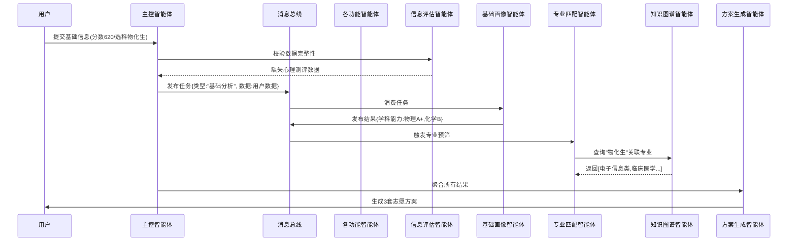
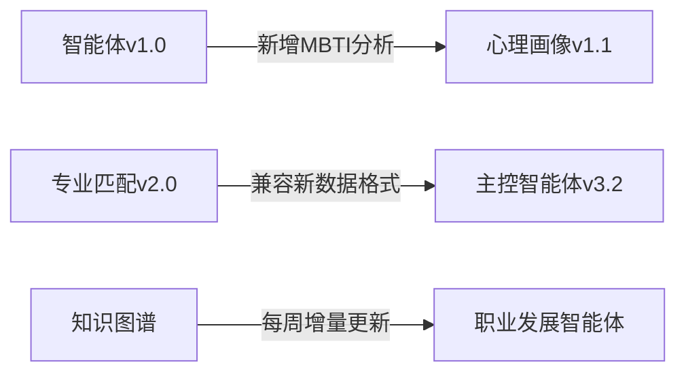

以下是关于多智能体系统协作机制和单个智能体调用的详细说明，采用模块化设计确保系统灵活性和可维护性：

---

### **一、智能体协作机制（基于消息总线的分布式架构）**
#### **1. 协作流程图解**


#### **2. 关键协作模式**
| 模式类型 | 应用场景 | 实现方式 |
|----------|----------|----------|
| **链式触发** | 基础分析流程 | 基础画像完成→自动触发专业匹配→触发院校筛选 |
| **并行计算** | 多维度评估 | 心理画像/兴趣分析/地域偏好同时进行 |
| **条件等待** | 依赖数据就绪 | 职业发展智能体需等待专业匹配完成 |
| **动态中断** | 风险超阈值 | 风险评估智能体可终止高风险方案生成 |

#### **3. 消息协议设计（JSON示例）**
```json
// 任务发布消息
{
  "task_id": "TASK_20240603_001",
  "sender": "master_agent",
  "receiver": ["profile_agent", "major_matcher"],
  "message_type": "analysis_request",
  "content": {
    "user_id": "U12345",
    "score": 620,
    "subjects": ["physics", "chemistry", "biology"]
  },
  "priority": 5
}

// 结果返回消息
{
  "task_id": "TASK_20240603_001",
  "sender": "major_matcher",
  "receiver": "solution_generator",
  "message_type": "analysis_result",
  "content": {
    "top_majors": [
      {"name": "临床医学", "match_score": 0.87},
      {"name": "生物工程", "match_score": 0.76}
    ]
  }
}
```

---

### **二、单个智能体调用方式**
#### **1. 直接调用（调试/测试场景）**
```python
# 通过FastAPI暴露的独立端点调用
import requests

# 调用基础画像智能体
response = requests.post(
    "http://agent-service:8000/basic_profile",
    json={
        "score": 620,
        "subjects": ["physics", "chemistry", "biology"]
    },
    headers={"X-Agent-Token": "API_KEY"}
)

# 返回结果示例
{
  "user_id": "U12345",
  "ability_assessment": {
    "physics": "A+", 
    "chemistry": "B"
  },
  "potential_majors": ["电子信息类", "材料科学"]
}
```

#### **2. 通过主控智能体调用（生产环境）**
```python
# 主控智能体协调调用示例
def coordinate_analysis(user_data):
    # 步骤1：基础分析
    basic_results = MasterAgent.call(
        agent="basic_profile",
        params=user_data
    )
    
    # 步骤2：根据结果触发后续任务
    if basic_results["physics"] == "A+":
        MasterAgent.parallel_call(
            agents=["major_matcher", "college_filter"],
            params={
                "user_id": user_data["id"],
                "ability_tags": basic_results["ability_tags"]
            }
        )
```

#### **3. 智能体注册中心（服务发现）**
```yaml
# 智能体元数据示例 (Consul注册中心)
services:
  - name: "major_matcher"
    address: "10.0.0.5"
    port: 8001
    tags: ["analysis", "core"]
    health_check: "/health"
    api_spec:
      - endpoint: "/match"
        method: "POST"
        input_schema: "schemas/major_match_input.json"
        
  - name: "risk_assessor"
    address: "10.0.0.6"
    port: 8002
    tags: ["evaluation"]
```

---

### **三、智能体间通信技术栈**
#### **1. 通信层设计**
| 组件 | 技术选型 | 用途 |
|------|----------|------|
| **消息总线** | RabbitMQ/Kafka | 异步任务分发 |
| **服务发现** | Consul/Nacos | 智能体动态注册 |
| **协议编码** | Protocol Buffers | 高效二进制传输 |
| **流控制** | Redis令牌桶 | 防止智能体过载 |

#### **2. 关键配置示例**
```python
# RabbitMQ消费者配置 (专业匹配智能体)
channel.basic_consume(
    queue='major_match_queue',
    on_message_callback=handle_match_request,
    auto_ack=False,
    arguments={
        'x-max-priority': 10  # 支持优先级队列
    }
)

# gRPC服务定义 (职业发展智能体)
service CareerAgent {
  rpc GetCareerPath (MajorRequest) returns (CareerResponse) {
    option (google.api.http) = {
      post: "/v1/career"
      body: "*"
    };
  }
}
```

---

### **四、异常处理机制**
#### **1. 智能体故障处理**
```python
try:
    result = await MajorMatcher.call(params)
except AgentTimeoutError:
    # 1. 重试机制
    retry_with_backoff(max_retries=3)
    
except DependencyNotReadyError:
    # 2. 降级处理
    use_cached_data()
    
except CriticalFailure:
    # 3. 熔断机制
    CircuitBreaker.open()
```

#### **2. 超时控制配置**
```yaml
# 主控智能体超时规则
timeout_policies:
  default: 5000ms
  critical:
    - agent: "risk_assessor"
      timeout: 10000ms
    - agent: "policy_monitor"
      timeout: 15000ms
```

---

### **五、调试与监控**
#### **1. 单个智能体测试流程**
```bash
# 1. 启动测试容器
docker run -p 8001:8001 major_matcher:test

# 2. 发送测试请求
curl -X POST http://localhost:8001/match \
  -H "Content-Type: application/json" \
  -d '{"score":620, "subjects":["physics"]}'

# 3. 查看日志
kubectl logs -f major-matcher-pod
```

#### **2. 分布式追踪集成**
```python
# OpenTelemetry埋点示例
from opentelemetry import trace

tracer = trace.get_tracer("major_matcher")

with tracer.start_as_current_span("match_calculation"):
    # 计算逻辑...
    span.set_attributes({
        "user.score": score,
        "matched_majors.count": len(results)
    })
```

---

### **六、智能体版本管理**


通过这套设计，系统既支持：
1. **自动化流水线**：用户提交数据后全自动生成方案
2. **人工干预调试**：可单独调用任一智能体进行测试
3. **灵活扩展**：新增智能体只需注册到服务中心即可参与协作

需要进一步了解某个具体智能体的内部状态机设计或消息处理逻辑吗？
